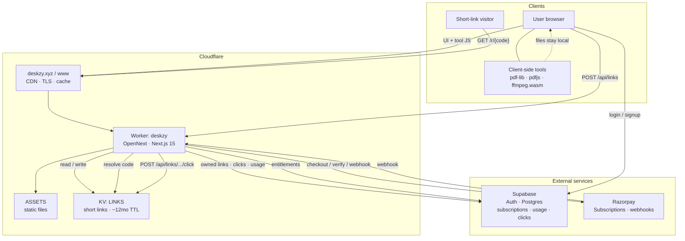

# Deskzy

Global file toolkit — PDF, image, and text utilities in one clean workspace.
Most tools run in the browser. URL shortening uses Cloudflare KV via the Next.js API.

**Site:** [deskzy.xyz](https://deskzy.xyz) · **Preview:** [deskzy.sshivanshg.workers.dev](https://deskzy.sshivanshg.workers.dev)

## System architecture

Deskzy is a Next.js app deployed to the Cloudflare edge. Most PDF / image / text / media tools run entirely in the browser. Only link shortening, auth, billing, and analytics hit the server.



### Request paths

| Path | Flow |
|------|------|
| **Browser tools** | Page + JS from Worker/ASSETS → process files in-browser → download result (no upload) |
| **Shorten** | `POST /api/links` → rate limit / optional `LINKS_API_KEY` → write `LINKS` KV (+ Supabase if signed in) → `jfas.site/p/{code}` |
| **Open short link** | `GET /p/{code}` → read KV → hop UI → click bumps KV hits; Pro links also write `link_clicks` in Supabase |
| **Auth / billing** | Supabase Auth for sessions; Razorpay for checkout; webhook updates `subscriptions` / seats / usage |

### Components

| Layer | Role |
|-------|------|
| **`apps/web`** | Product surface — UI, tool runners, App Router API routes |
| **OpenNext + Worker `deskzy`** | SSR, API, static assets on Cloudflare (`deskzy.xyz`, `www.deskzy.xyz`) |
| **KV `LINKS`** | Source of truth for short-link redirects |
| **Supabase** | Auth, entitlements, owned-link analytics, daily usage |
| **Razorpay** | Pro subscription checkout + webhooks |
| **`services/api`** | Optional Go + Chi short-link API for local `/deskzy-api` only — **not used in production** |

### Stack

- **apps/web** — Next.js 15 (App Router) on **Cloudflare Workers** via OpenNext
- **services/api** — Go + Chi short-link API (optional local; production uses Next `/api` + KV)
- Short links stored in Cloudflare KV (`LINKS`)
- Auth / billing / analytics data in **Supabase**; payments via **Razorpay**

## Quick start (local)

```bash
# Web (Next.js)
npm install
npm run dev

# Optional: Go API (only if testing /deskzy-api proxy)
cd services/api && go run ./cmd/api
```

Open [http://localhost:3000](http://localhost:3000).

## Deploy (Cloudflare)

```bash
# One-time: wrangler login
npm run deploy:web
```

This builds with OpenNext and deploys the `deskzy` Worker (custom domains `deskzy.xyz` / `www.deskzy.xyz`, plus `*.workers.dev`).

### DNS cutover (required for apex)

The Cloudflare zone is created but **pending** until the registrar nameservers point at Cloudflare.

At your registrar (currently GoDaddy / DomainControl), set nameservers to:

- `adrian.ns.cloudflare.com`
- `leonidas.ns.cloudflare.com`

Then remove `deskzy.xyz` from the Vercel project domains so Vercel is no longer an origin.

Until NS propagate, use https://deskzy.sshivanshg.workers.dev

### Workers Builds (optional CI)

In Cloudflare Dashboard → Workers & Pages → `deskzy` → Settings → Builds:

- Connect GitHub repo `sshivanshg/deskzy`
- Root directory: repo root
- Build command: `npm install && npm run deploy -w @deskzy/web`  
  (or OpenNext `upload` if you prefer version upload without immediate promote)

## Tools included

PDF: merge, split, compress, reorder, PDF→images  
Image: compress, resize, convert, WebP→PNG  
Text: JSON, Base64, hash, UUID, encode, word count, case, markdown, password  
Links: URL shortener, multi-link shortener, QR, UTM builder, WhatsApp link, bio link creator  
Media: Media Converter, Video→MP3/WAV, Audio Converter (ffmpeg.wasm in-browser)

## Scripts

| Command | What |
|---------|------|
| `npm run dev` | Next.js on :3000 |
| `npm run build` | Next production build |
| `npm run deploy:web` | OpenNext build + Cloudflare deploy |
| `npm run preview:web` | OpenNext preview in workerd |
| `npm run dev:api` | Go API on :8080 |
| `npm run build:api` | Compile Go binary |

## Privacy

Browser tools never upload files. The URL shortener only sends the URL string(s) to the API (KV-backed on Cloudflare, ~12 month TTL, rate-limited).

### Machine API (scripted shortens)

**Pro / Business:** generate a key in Account → API (`dz_…`). Creates are owned by that user and skip the public IP rate limit.

**Internal pipeline:** optional Worker secret `LINKS_API_KEY` (not for customers):

```bash
printf '%s' 'your-secret' | npx wrangler secret put LINKS_API_KEY -c apps/web/wrangler.jsonc
```

Authenticated creates (`Authorization: Bearer <key>`) bypass the public per-IP rate limit. Keep secrets out of git.

**Single URL**

```bash
curl -X POST https://deskzy.xyz/api/links \
  -H "Authorization: Bearer your-secret" \
  -H "Content-Type: application/json" \
  -d '{"url":"https://example.com"}'
```

Response (`201`):

```json
{
  "code": "Ab12CdE",
  "kind": "single",
  "dest": "https://example.com/",
  "shortUrl": "https://jfas.site/p/Ab12CdE",
  "createdAt": "...",
  "isCustom": false
}
```

**Multi-link (list page)** — pass `urls` as an array, or whitespace-separated links in `url`:

```bash
# preferred: explicit array
curl -X POST https://deskzy.xyz/api/links \
  -H "Authorization: Bearer your-secret" \
  -H "Content-Type: application/json" \
  -d '{"urls":["https://example.com/a","https://example.com/b","https://example.com/c"]}'

# also works: space / newline separated paste in url
curl -X POST https://deskzy.xyz/api/links \
  -H "Authorization: Bearer your-secret" \
  -H "Content-Type: application/json" \
  -d '{"url":"https://example.com/a https://example.com/b"}'
```

Response (`201`):

```json
{
  "code": "Xy98ZqW",
  "kind": "list",
  "dest": "https://example.com/a",
  "urls": [
    "https://example.com/a",
    "https://example.com/b",
    "https://example.com/c"
  ],
  "shortUrl": "https://jfas.site/p/Xy98ZqW",
  "createdAt": "...",
  "isCustom": false
}
```

`shortUrl` opens a list hop at `/r/{code}` where recipients pick a destination. Optional `slug` (Pro session only) works the same as single creates.

Legal pages on the live site: [/privacy](https://deskzy.xyz/privacy) · [/terms](https://deskzy.xyz/terms)
